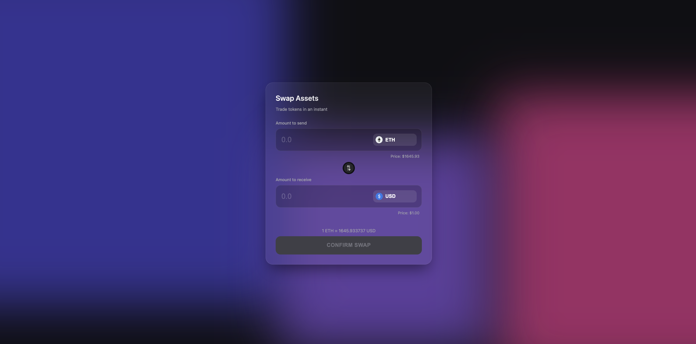
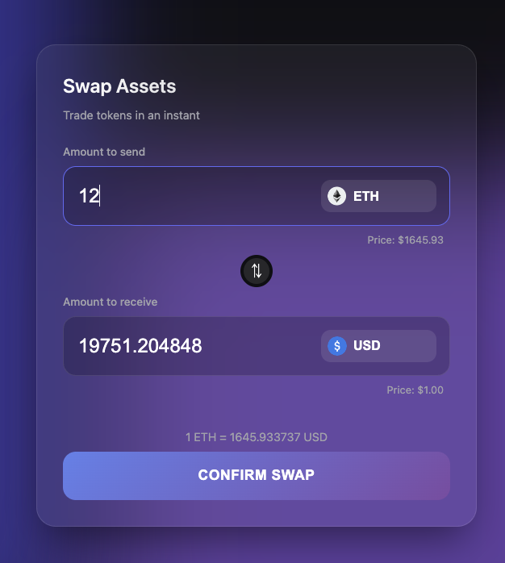
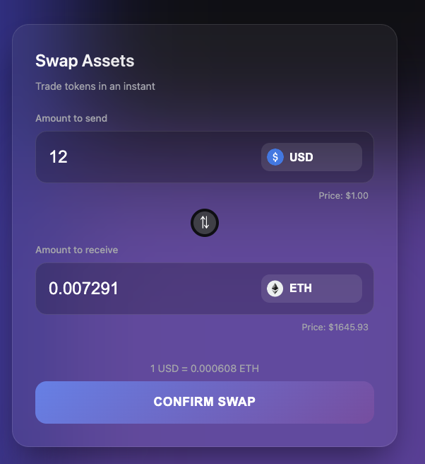
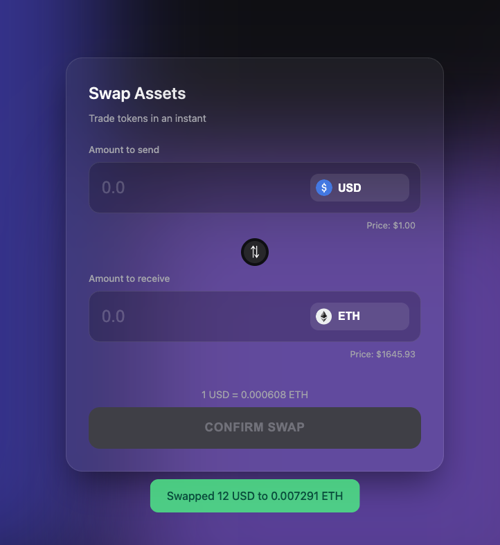

# Problem 2: Currency Swap Form

A feature-rich currency swap form built with React, TypeScript, and Vite.

## Features

- **Real-time Price Fetching**: Fetches token prices from the interview API.
- **Premium UI**: Glassmorphism design with animated background blobs.
- **Interactive**:
  - Swap functionality with mock backend delay.
  - Form validation.
  - Currency switching.
  - Dynamic exchange rate calculation.
- **Responsive**: Fully responsive design for mobile and desktop.

## Setup & Run

1. Install dependencies:

   ```bash
   npm install
   ```

2. Run development server:

   ```bash
   npm run dev
   ```

3. Build for production:
   ```bash
   npm run build
   ```

## Results

### Overall UI



### Swapping ETH to USD



### Swapping USD to ETH



### Swap Success


