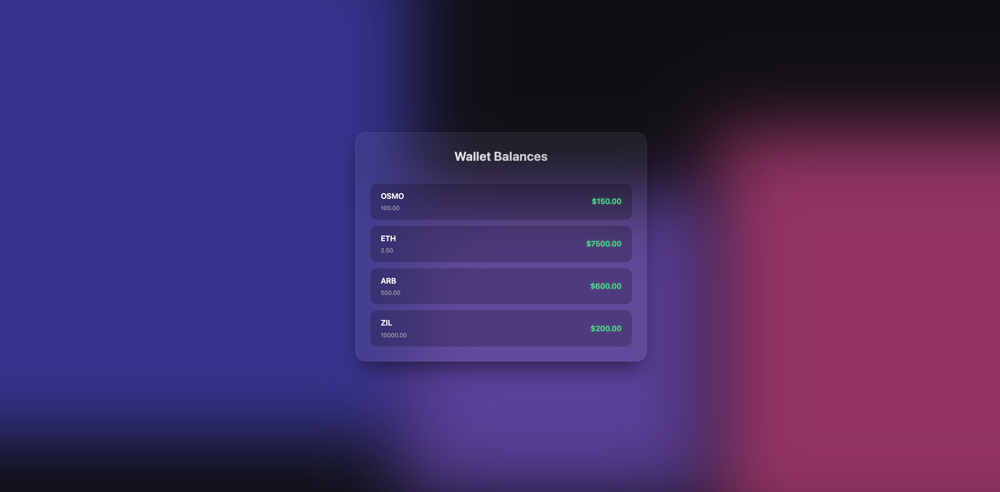

# Problem 3: Messy React Code

## Issues Found

1.  **Undefined Variable**: `lhsPriority` is used in filtering but never defined.
2.  **Logic Error**: The filter condition `balance.amount <= 0` incorrectly includes empty/negative balances instead of positive ones.
3.  **Missing Type Definition**: `WalletBalance` interface lacks the `blockchain` property.
4.  **Use of `any`**: The `blockchain` parameter in `getPriority` uses `any` instead of a specific type.
5.  **Unnecessary Dependency**: `prices` is in the `useMemo` dependency array for `sortedBalances` but isn't used there.
6.  **Redundant Calculations**: `getPriority` is called repeatedly for the same items during sort and filter.
7.  **Incomplete Sort**: The comparator doesn't explicitly return `0` for equal priorities, leading to unstable sorting.
8.  **Double Iteration**: `formattedBalances` is mapped but then `rows` maps over `sortedBalances` again unnecessarily.
9.  **Key Anti-pattern**: Using array index as a React key is unsafe for lists that can change order.
10. **Type Mismatch**: `rows` map tries to access `balance.formatted` on `sortedBalances` items where it doesn't exist.
11. **Undefined Variable**: `classes.row` is used but `classes` is undefined.
12. **Redundant Type**: `(props: Props)` is redundant when using `React.FC<Props>`.
13. **Empty Interface**: `Props` interface is empty and extends `BoxProps` without adding anything.
14. **Unused Variable**: `children` is destructured but never used.
15. **Missing Memoization**: `formattedBalances` is re-calculated on every render.
16. **Missing Memoization**: `rows` is re-calculated on every render, causing unnecessary child re-renders.

## Refactored Code

```tsx
import React, { useMemo } from "react";

// Added Constants to avoid hardcoding strings

interface Props extends BoxProps {}

const BLOCKCHAIN = {
  OSMOSIS: "Osmosis",
  ETHEREUM: "Ethereum",
  ARBITRUM: "Arbitrum",
  ZILLIQA: "Zilliqa",
  NEO: "Neo",
} as const;

type Blockchain = (typeof BLOCKCHAIN)[keyof typeof BLOCKCHAIN] | string;

interface WalletBalance {
  currency: string;
  amount: number;
  blockchain: Blockchain;
}

interface FormattedWalletBalance extends WalletBalance {
  formatted: string;
}

interface Props extends BoxProps {}

const WalletPage: React.FC<Props> = (props: Props) => {
  const { children, ...rest } = props;
  const balances = useWalletBalances();
  const prices = usePrices();

  const getPriority = (blockchain: Blockchain): number => {
    switch (blockchain) {
      case BLOCKCHAIN.OSMOSIS:
        return 100;
      case BLOCKCHAIN.ETHEREUM:
        return 50;
      case BLOCKCHAIN.ARBITRUM:
        return 30;
      case BLOCKCHAIN.ZILLIQA:
        return 20;
      case BLOCKCHAIN.NEO:
        return 20;
      default:
        return -99;
    }
  };

  const sortedBalances = useMemo(() => {
    return balances
      .filter((balance: WalletBalance) => {
        const balancePriority = getPriority(balance.blockchain);
        return balancePriority > -99 && balance.amount > 0;
      })
      .sort((lhs: WalletBalance, rhs: WalletBalance) => {
        const leftPriority = getPriority(lhs.blockchain);
        const rightPriority = getPriority(rhs.blockchain);
        if (leftPriority > rightPriority) return -1;
        if (rightPriority > leftPriority) return 1;
        return 0;
      });
  }, [balances]);

  const formattedBalances: FormattedWalletBalance[] = useMemo(() => {
    return sortedBalances.map((balance: WalletBalance) => {
      return {
        ...balance,
        formatted: balance.amount.toFixed(2),
      };
    });
  }, [sortedBalances]);

  const rows = useMemo(() => {
    return formattedBalances.map((balance: FormattedWalletBalance) => {
      const usdValue = (prices[balance.currency] || 0) * balance.amount;
      return (
        <WalletRow
          className="wallet-row-item"
          key={balance.currency}
          amount={balance.amount}
          usdValue={usdValue}
          formattedAmount={balance.formatted}
        />
      );
    });
  }, [formattedBalances, prices]);

  return <div {...rest}>{rows}</div>;
};
```

## Results


